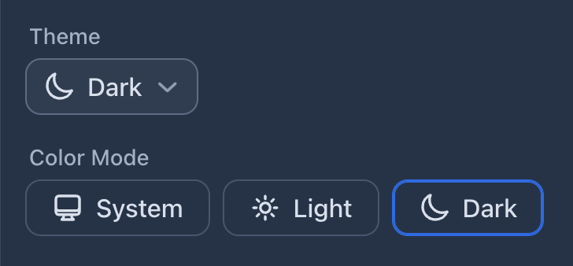

# Theme Select components for Vaadin

These components allow the user of your application to choose the color mode, a.k.a. theme, of the application.

The options are hardcoded to “System”, “Light”, and “Dark”.

If you use multiple theme select components in the same app, they all stay in sync without extra effort from your part. Just add the components in any view/layout in your app, and they’ll work as expected.

The user’s preferred theme is stored in the browser’s `localStorage`.


## Components

You can choose from the following components, how you want to offer this choice to the users of your application.


### ThemeSelect

The `ThemeSelect` component renders as a popover menu:


#### Minimal Variant


Add the `.minimal` class to the `ThemeSelect` component to hide the labels. The labels are still visible in the popover, just like in the default variant. The `aria-label` attribute is set when you define a label for the component.

When the “System” theme is used, the minimal variant shows the effective theme in the collapsed state.


### ThemeRadioGroup

The `ThemeRadioGroup` component renders as a group of radio buttons:


## Usage

After adding the add-on dependency to your project’s pom.xml, using the components is straightforward.

In Vaadin Flow:
```java
public class MyView extends Div {
  public MyView() {
    add(new ThemeSelect("Theme"));

    ThemeSelect minimalSelect = new ThemeSelect("Choose theme");
    minimalSelect.addClassNames("minimal");
    add(minimalSelect);

    add(new ThemeRadioGroup("Color Mode"));
  }
}

```

In Vaadin Hilla:
```jsx
export default function MyView() {
  return <div>
    <ThemeSelect label="Theme" />

    <ThemeSelect className="minimal" label="Choose theme" />;

    <ThemeRadioGroup label="Color Mode" />
  </div>;
}
```


### Customization

You can customize the style of the component the same you can style official Vaadin components, [using the Lumo CSS custom properties](https://vaadin.com/docs/latest/styling/styling-components#styling-components-with-style-properties).

For example:

```css
html {
  --lumo-border-radius-m: 10px;
  --vaadin-input-field-border-width: 1px;
  --vaadin-input-field-border-color: var(--lumo-contrast-30pct);
  --vaadin-input-field-background: var(--lumo-tint-5pct);
}
```




### Localization

To change the labels of the theme options (i.e., “System”, “Light”, and “Dark”), define the following CSS custom properties in your main stylesheet, for example:

styles.css:
```css
html {
  --theme-label-system: "OS";
  --theme-label-light: "Day";
  --theme-label-dark: "Night";
}
```


## Problems?

Submit an issue in [the GitHub repo](https://github.com/jouni/theme-select).
